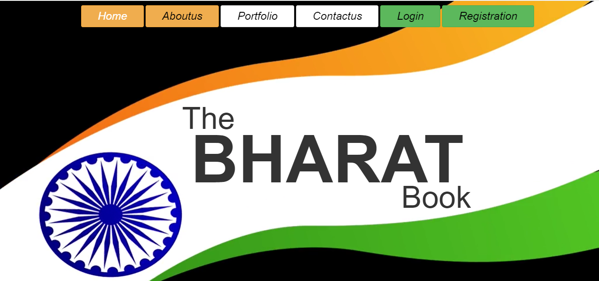
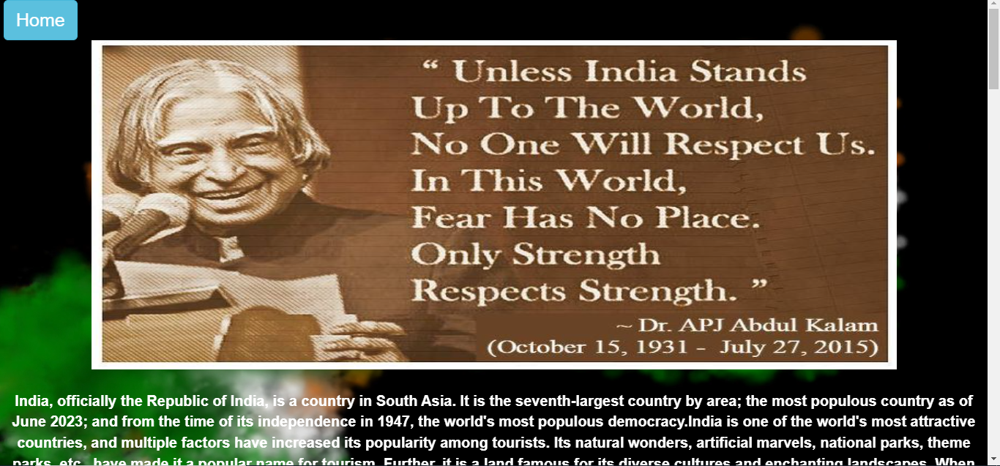
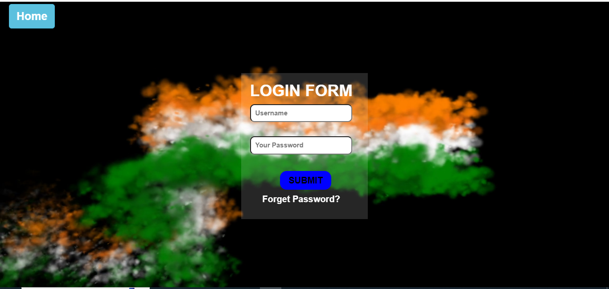
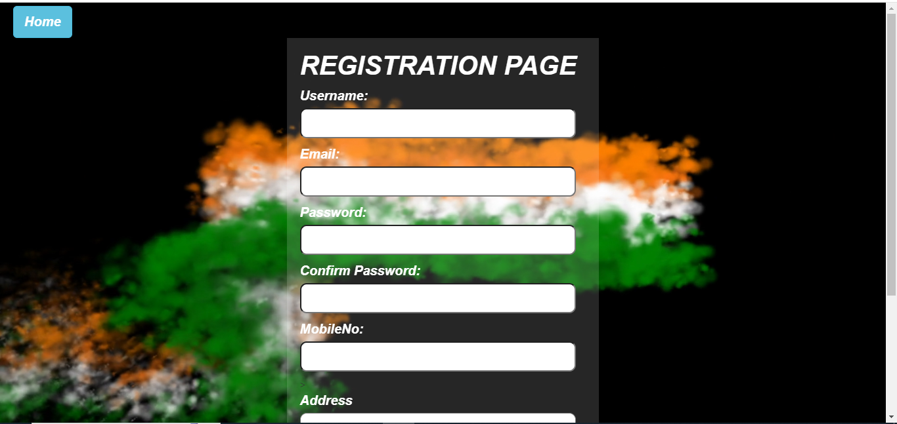
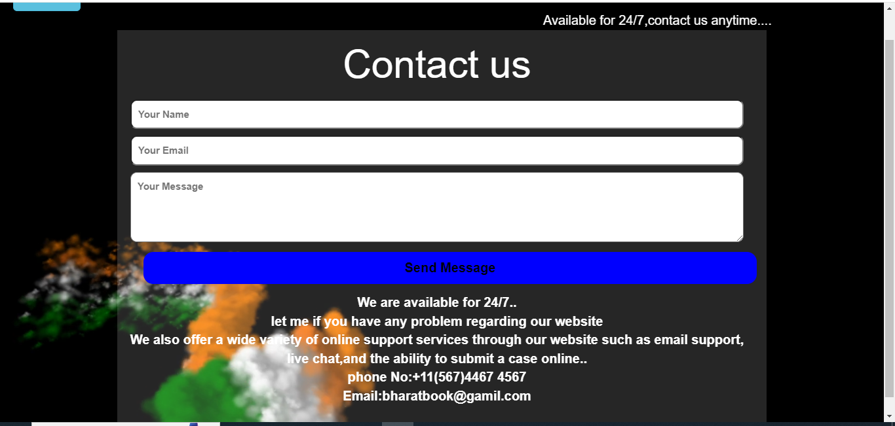
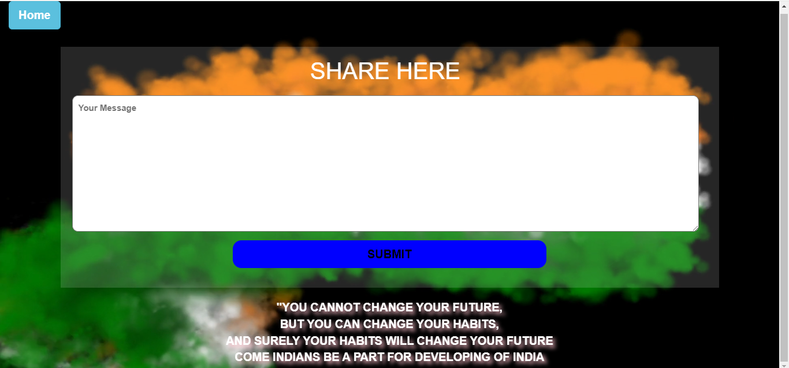

# The Bharat Book

**The Bharat Book** is a static, UI/UX-focused website designed to present India's challenges and potential solutions in a visually engaging and user-friendly format. Built with HTML5, CSS3, JavaScript, and Bootstrap, this website is fully responsive and includes interactive navigation between multiple pages — all without any backend integration.

---

## 📌 Project Overview

**The Bharat Book** aims to increase awareness about the pressing challenges faced by India and encourage collective thinking through a simple, elegant user interface. This static website provides multiple interconnected pages, each serving a unique purpose to engage users in the conversation around national development.

---

## 🧩 Website Structure

### 🏠 Home Page
- Displays the **website thumbnail** and introductory content.
- Lists **features with navigation links** to other sections/pages.

### ℹ️ About Us
- Describes **recent challenges** facing India.
- Sets the context for the purpose of the platform.

### 🧑‍💻 Portfolio
- Showcases details about the **developer/creator** of the project.

### 🔐 Login Page
- UI-only login form.
- Leads users to the **Sharing Page** upon (mock) login.

### 📝 Sharing Page
- Allows users to **share their thoughts** and potential solutions to India's challenges.
- Static interface with form fields (no backend submission).

### 🧾 Registration Page
- UI-only form for **first-time users** to register.
- Collects basic user information.

---

## 🚀 Features

- ✅ Fully **responsive** layout using **Bootstrap** and **custom media queries** for fine-tuned breakpoints.
- ✅ Clean, modern **UI/UX design** with intuitive navigation.
- ✅ Interactive components and transitions powered by **JavaScript**.
- ✅ Mobile-first approach using both **framework and custom CSS techniques**.
- ❌ **No backend functionality** (forms are non-functional and purely visual).

---

## 🛠️ Tech Stack

- **HTML5** – Page structure and semantics  
- **CSS3** – Styling, layout, and media queries for responsiveness  
- **JavaScript** – Client-side interactivity  
- **Bootstrap** – Responsive, mobile-first design framework

---

## 📸 Screenshots

### 🏠 Home Page


### ℹ️ About Us


### 🧑‍💻 Login Page


### 🧑‍💻 Registration Page


### 🧑‍💻 Contact Us


### 🧑‍💻 sharing Page


---

## 📁 Getting Started

To view the website locally:

1. **Clone this repository**:
   ```bash
   git clone https://github.com/NafshaTabasum/Main-Project.git
2. **Navigate to the folder**:
   ```bash
   cd Main Project
3. **Open FINAL PROJECT.html with your browser**:
   - You can simply double-click the FINAL PROJECT.html file
   - Or run a local server (e.g., with Live Server extension in VS Code)

---

## 📄 License

This project is created for **educational purposes only**.  
It is licensed under the [MIT License](https://opensource.org/licenses/MIT), allowing free use, modification, and distribution with proper attribution.

---

## 🙏 Acknowledgements

- [Bootstrap](https://getbootstrap.com/) – for the responsive design framework  
- [W3Schools](https://www.w3schools.com/) – for tutorials and references  
- All educators and mentors who supported my learning journey  
- Friends and peers who provided feedback and encouragement

---

## 📬 Contact

For questions or suggestions related to this project, please feel free to open an issue on this GitHub repository.


